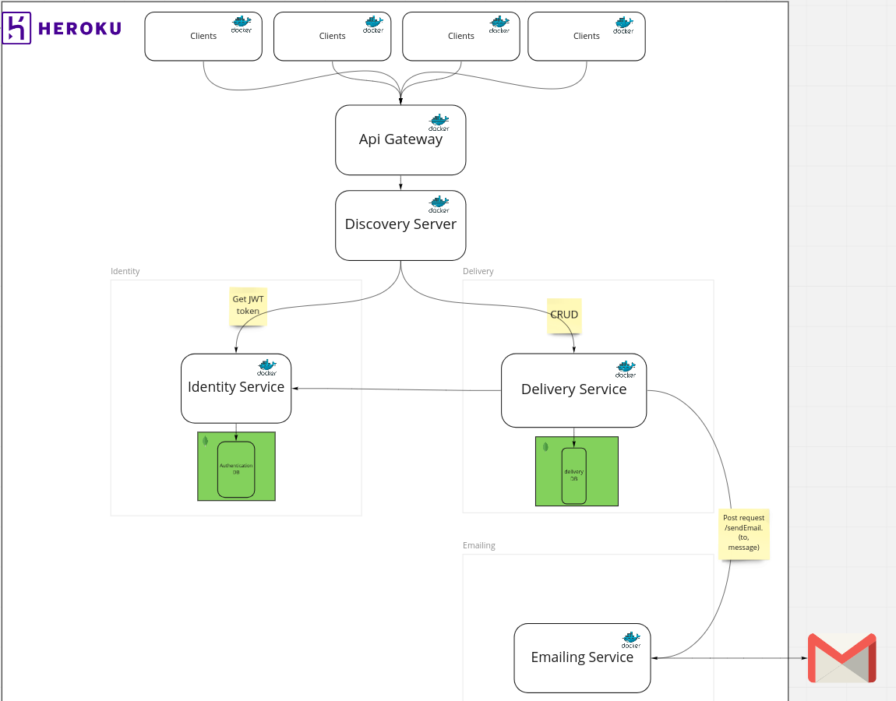

# ase-delivery-system

### Introduction

ASE Delivery system was developed as part of the Advanced Topics in Software Engineering class. 
Based on the scope of the project description, we have developed a delivery system that coordinates 
the delivery from a central depot via RFID pick-up boxes to customers. 

The system includes functionality for different user roles consisting of dispatchers, deliverers, and customers.

### Architecture of ASE Delivery system 





### CI/CD Pipeline

We have set up the pipeline which includes two jobs, one for package and one for deployment to heroku.

### Live Application

https://ase-delivery-system.herokuapp.com/

### How to run the project

#### Locally

To run the complete project locally you need to start all services that are in backend folder and the frontend

So, being at root directory of each service under backend folder you type

``` mvn package ``` 

and then after the package is done type the following command to run the project

``` java -jar target/spacex-flight-api-0.0.1-SNAPSHOT.jar ``` 

do this for each service.

To run the frontend, go under frontend folder type the following commands: 

``` npm install ```

``` npm start ```


#### Using Docker

You need to have docker and docker-compose installed and then run under ase-delivery-system folder the following command:

``` docker-compose up ``` 

You might have to wait some time

## Built With

* [Java](https://docs.aws.amazon.com/corretto/latest/corretto-11-ug/downloads-list.html) -  Java 11
* [Spring Boot](https://spring.io/projects/spring-boot) - Spring Boot
* [Maven](https://maven.apache.org/) - Dependency Management
* [Docker](https://www.docker.com/) - Containerized App
* [Reactjs](https://reactjs.org/) - A JavaScript library for building user interfaces
* [ApiGateway](https://spring.io/projects/spring-cloud-gateway) - Spring Cloud Gateway
* [Service Discovery](https://spring.io/guides/gs/service-registration-and-discovery/) - Service Registration and Discovery with Eureka
* [MUI](https://mui.com/) - The React UI library
* [MongoDB](https://www.mongodb.com/) - NoSQL Database
* [Heroku](https://en.wikipedia.org/wiki/Heroku) - Cloud provider


### Versioning

This project does not have versioning

### Authors
* **Pellumb Baboci**
* **Wendy B. F. Barreto Flores**
* **Cristina Ioana Bobes**
* **Eugenia Clarissa Anjani**
* **Liudongnan Yang**


### Note:

When you try to make a request to the live api for the first time, it might take some time because we are using free version of the cloud provider

